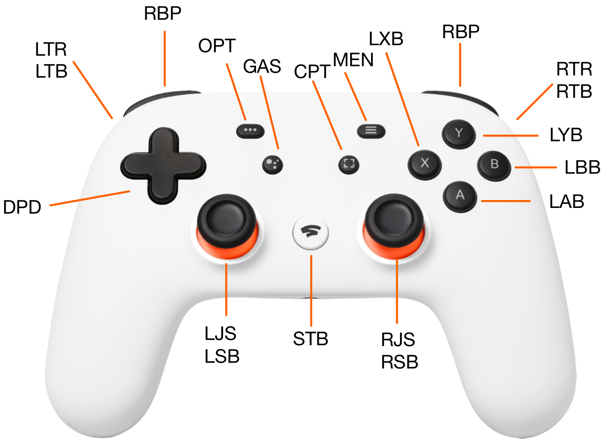

# StadiaCon

This package uses the esp32 Bluedroid stack to connect esp32C6 development board to a Google Stadia controller with the generic ble firmware installed on it. It then outputs the commands issued from the Stadia controller out as ASCII over the USB/UART bridge on the C6.

## Control IDS:

Each control on the Stadia controller is assigned 3 letter unique identifier which proceeds the value in the output. These are assigned according to the following map:



Notice that the triggers have two IDs assigned each, one which ranges from 0-100 (LTR/RTR) as the trigger is pressed, and another which is digital (LTB/RTB).

The joysticks also have two assigned IDs, one for the stick pointing direction (LJS/RJS) and one for the button activated by pressing down on the stick (LSB/RSB).

## Configuration:

The options configureable to a user of this package may be edited in the globalconst.h/globalconst.c files under the main directory. The options are:

  - ```#define remote_device_name```: The name of the remote device to connect to. This should be the name of the Google Stadia controller. Different controllers will have different identifiers in their names so this should be edited to your device to discover your device when scanning.
  - ```#define GATTC_DEBUG```: Enables debug logging for the ble paring process
  - ```#define UART_DEBUG```: Enables debug logging for the output of the controller commands. Will print the commands that should be being written to UART to the console.
  - ```const uart_port_t uart_num```: The UART port to write the controller commands to. This should be set to the port that the USB/UART bridge is connected to on the esp32C6.
  - ```bool publish_controls[20]```: One bool for every output identifier on the controller. If set to true, the output of that control will be written to the UART port. If set to false, the output of that control will be ignored.

## Structure

The ble utility functions are organized into modules:
 - ble - all bluetooth functionality
   - auth_gap.h - all pairing and authentication functions
   - gattc.h - all gatt client functions for receiving data from the controller
   - bt_init.h - all bluetooth initialization functions
 - publish - All functions for writing the controller commands to the UART port
   - rep_queue.h - A queue for storing controller command reports to be parsed and written to the UART
   - con_state.h - Stores the current state of the controller and updates it based on the reports received. Outputs the commands to the UART when they are updated and the control is set to be published.
 - globalconst.h - user configuration options
 - main.c - The main function which initializes the bluetooth stack, connects to the controller, and then enters a loop to receive and publish controller commands.
